# 一、物体识别（检测）

### 1. 选择权重


说明：

1. yolov5s.pt、yolov5m.pt、yolov5l.pt、yolov5x.pt 为自带的预训练权重，可识别一般普通物体如：人、猫、狗、车等
2. 可以选择自训练权重对专一物体进行识别检测

### 2. 上传识别

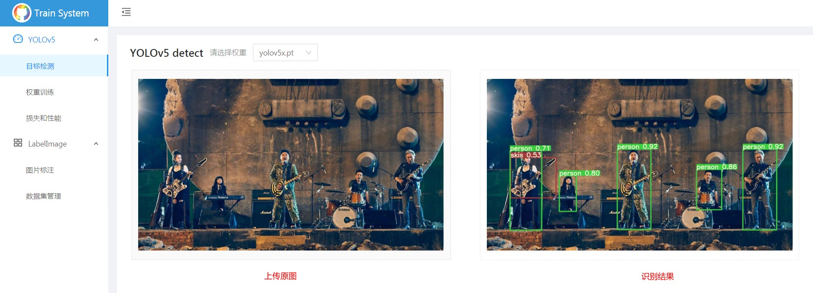

# 二、物体训练

## 1. 图片标注

### 1.1 新建数据集


注意：尽量不使用中文！

### 1.2 上传图片

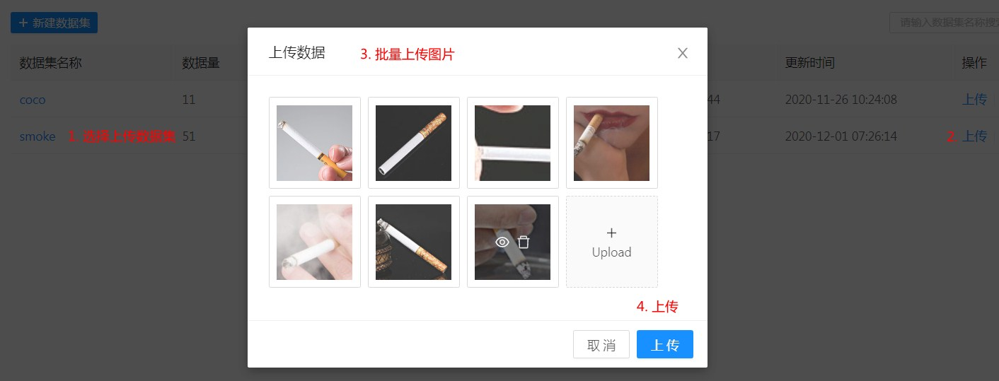

注意：图片名称不能出现中文！

### 1.3 选择标注数据集

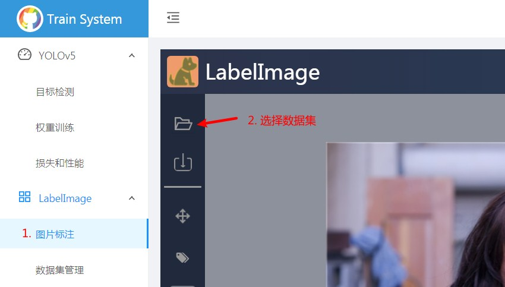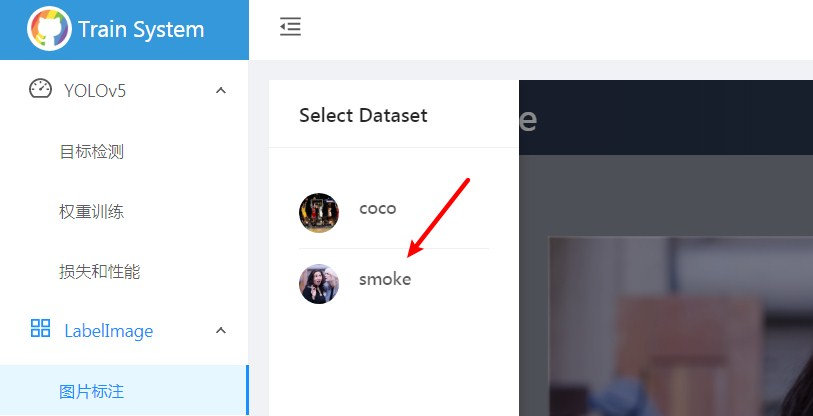

### 1.4 新建标注类

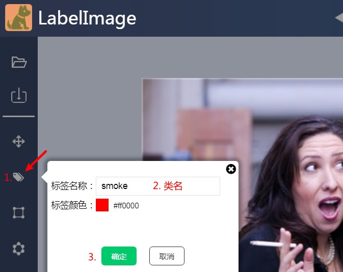

### 1.5 进行标注

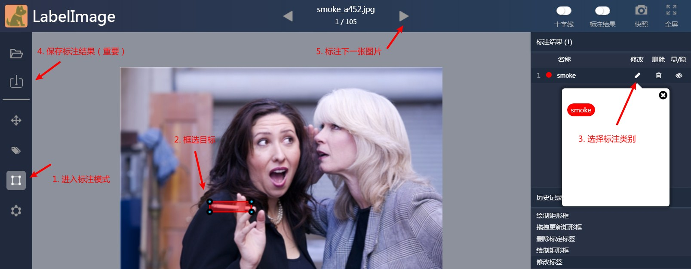

注意，每次标注完当前图片后必须进行保存！

## 2. 权重训练

### 2.1 选择数据集

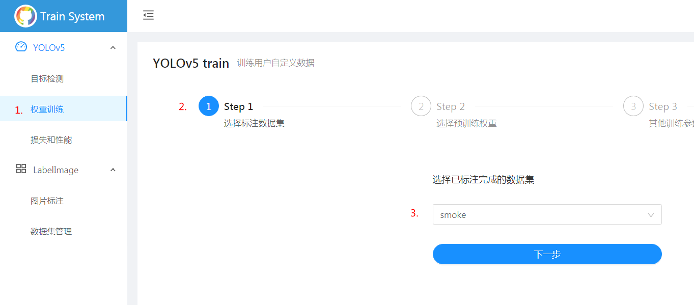

注意：数据集必须标注完全，即每一张图片都需要有对应标注信息。

### 2.2 选择预训练权重

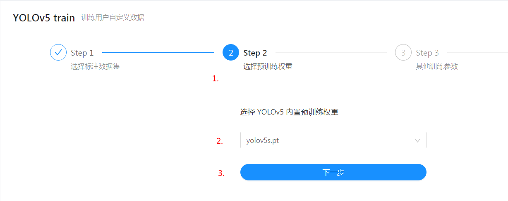

### 2.3 其他训练参数

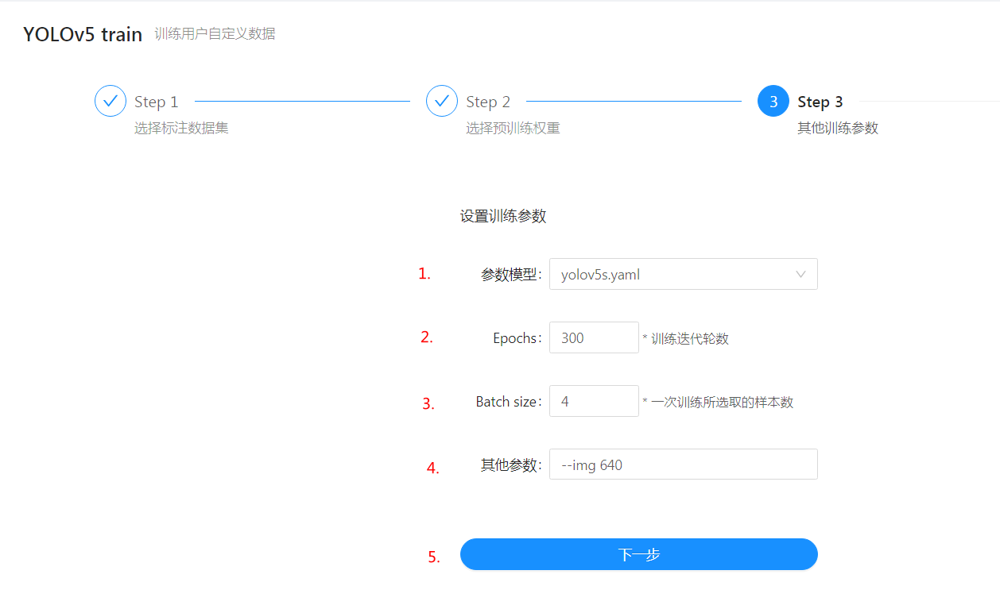

### 2.4 开始训练

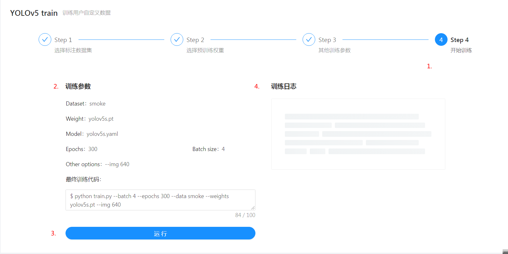

如果训练日志输出超出内存限制，请适当降低 Batch size 参数：

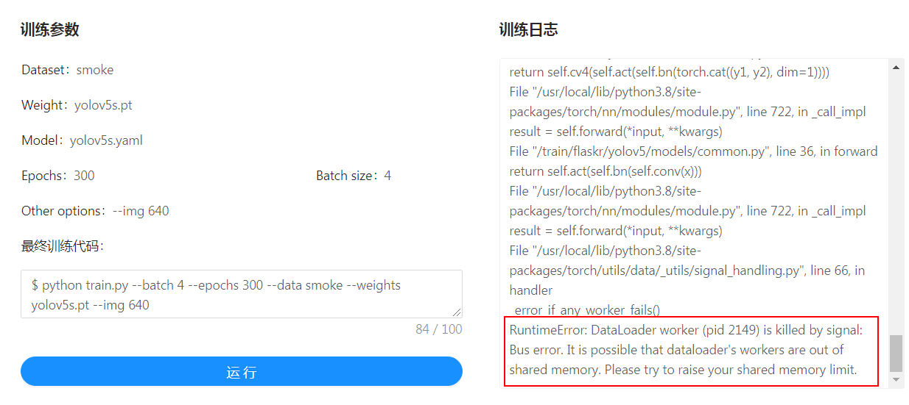


## 3. 性能和损失

### 3.1 训练日志查看

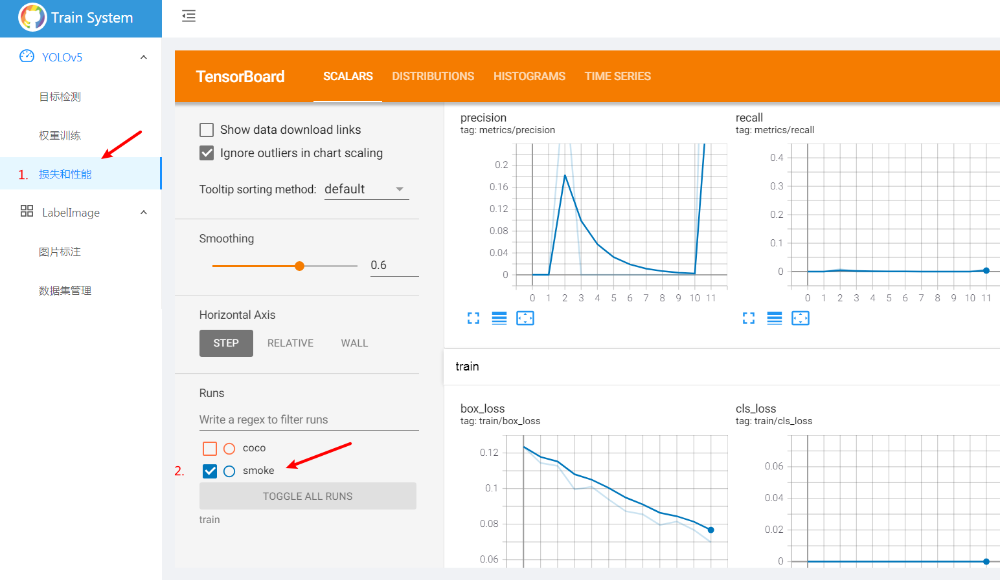

### 3.2 训练权重检测

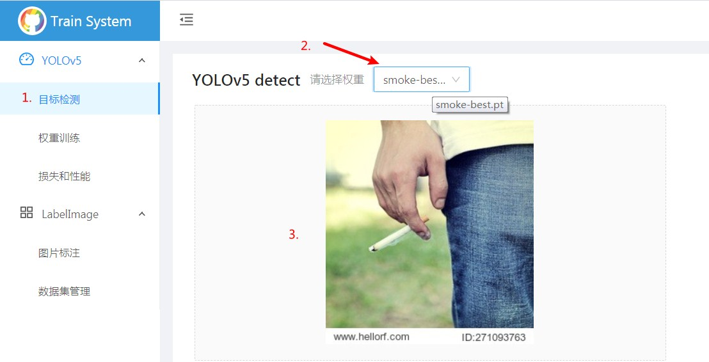

# 三、项目部署

## 1. 环境要求

### 1.1 Docker容器

- 系统测试环境为Ubuntu 16.04.6 LTS，Linux内核为4.15.0：

```
   Static hostname: 304
         Icon name: computer-desktop
           Chassis: desktop
        Machine ID: 1d0f19d8da7049cdaa13ef3402ecdc18
           Boot ID: a07e6032ce044fac872d74c61b339b8f
  Operating System: Ubuntu 16.04.6 LTS
            Kernel: Linux 4.15.0-70-generic
      Architecture: x86-64
```

- Docker容器版本为19.03，尽量使用较新版本Docker：

```
Docker version 19.03.13, build 4484c46d9d
```

### 1.2 所需镜像

- ~~mysql:5.7  mysql数据库镜像~~

```
docker pull mysql:5.7
```

- flasktrain:latest    项目镜像

```
docker pull registry.cn-hangzhou.aliyuncs.com/lvjune/yolov5_train_system:latest
```

或从Dockerfile构建：

``` shell
docker build . -t yolov5-train-system:latest
```

**更新**：已移除mysql数据库的使用，改为本地化存储的sqlite3数据库。

## **2. 项目配置**

### ~~2.1 数据库配置~~

- ~~启动一个mysql数据库容器，映射到主机端口为33066，root密码为123456~~

```
docker run -d -e MYSQL_ROOT_PASSWORD=123456 -p 33066:3306 mysql:5.7
```

- ~~启动并进入容器，创建数据库~~

```
mysql -uroot -p123456
create database train_system;
```

### 2.2 训练系统配置

- ~~启动一个flasktrain容器，映射三个端口，分别是：5050对应后端访问端口、6060对应Tensorboard访问端口、8080对应前端访问端口~~

```
docker run -d -p 5050:5000 -p 6060:6006 -p 8080:80 flasktrain
```

- ~~启动并进入容器，修改前端访问服务器地址：~~

```
vim /train/vue/config.js
```

```
FLASK_CONFIG.baseUrl = "http://服务器IP地址:5050"
FLASK_CONFIG.tensorboardUrl = "http://服务器IP地址:6060/"
```

**更新**：使用nginx做反向代理，在容器内部解决了前后端跨域访问的问题。详见*nginx.conf*文件代理内容。无需手动修改端口、地址访问配置。

## 3. 项目运行 

### ~~3.1 运行前端~~

```
service nginx start
```

### ~~3.2 运行后端~~

```
cd /train && python run.py
```

### ~~3.3 浏览器访问~~

```
http://服务IP地址:8080/
```

**更新**：将启动命令写入*startup.sh*文件，内容如下：

```shell
#!/bin/bash

# cd /train
host=`cat /etc/hosts | awk 'END {print}' | cut -f 1`
sed -i "s/127.0.0.1/${host}/g" nginx.conf
nginx -c /train/nginx.conf
python run.py

# docker run -d -p 80:80 yolov5trainsystem ./startup.sh
# set ff=unix
# chmod +x ./startup.sh
```

首先获容器内docker分配的虚拟地址，替换掉nginx代理时的127.0.0.1，以供宿主机访问，然后启动nginx前端和flask后端。

启动容器指令:

``` shell
docker run -d -p 80:80 yolov5trainsystem:latest
```

浏览器访问80端口。